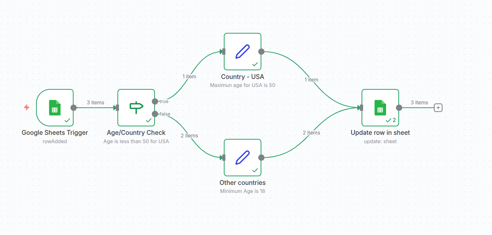

# 📊 GoogleSheet Automation

A complete workflow automation system using **Node.js** and **n8n** to collect, validate, and synchronize user form data into Google Sheets.

---

## 📸 Workflow Screenshot



---

## 🎥 Demo Video

> 📌 Click to view the video stored in this repository  
> (GitHub UI will show preview automatically)

[▶ Watch Workflow Automation Recording](./assets/workflow-automation-recording.mp4)

---

## 🏷️ Project Overview

This project automates the validation of user-submitted data inside a Google Spreadsheet.

### 🔄 Data Flow

1. User submits a form (Name, Age, Country)
2. Form data is inserted into Google Sheets
3. n8n workflow triggers on **new row**
4. Validation rules applied
5. Updates column **`validation`** with:
   - ✔ `validated`
   - ❌ `invalid`

---

## 🔍 Validation Rules

| Condition | Output |
|----------|--------|
| Country = US AND Age ≤ 50 | validated |
| Country ≠ US AND Age ≥ 18 | validated |
| Otherwise | invalid |

---

## 🛠️ Tech Stack

| Technology | Purpose |
|-----------|---------|
| Node.js | Backend form/API |
| n8n | Automation engine |
| Google Sheets API | Data storage & updates |

---
### Add Google API Credentials File 
Create a file named `credentials.json` in the root directory of the project:
```
{
  "client_id": "YOUR_CLIENT_ID",
  "project_id": "YOUR_PROJECT_ID",
  "auth_uri": "https://accounts.google.com/o/oauth2/auth",
  "token_uri": "https://oauth2.googleapis.com/token",
  "auth_provider_x509_cert_url": "https://www.googleapis.com/oauth2/v1/certs",
  "client_secret": "YOUR_CLIENT_SECRET",
  "redirect_uris": [
    "http://localhost:5000"
  ],
  "client_email": "YOUR_SERVICE_ACCOUNT_EMAIL",
  "private_key": "YOUR_PRIVATE_KEY"
}
```
## 🚀 Installation & Setup

Clone the repository and install dependencies:

```bash
npm install
npm run start
```